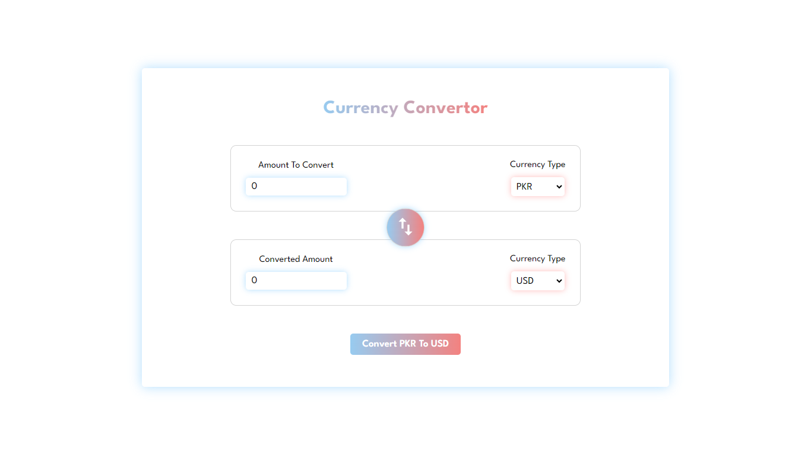

# Currency Converter

A simple currency converter web application that allows users to convert between different currencies in real-time.




## Features

- Real-time currency conversion between multiple currencies.
- Intuitive UI with clear input fields for entering the amount to convert and selecting currencies.
- Swap functionality to quickly switch between the currencies being converted.
- Responsive design, suitable for both desktop and mobile devices.

## Installation

1. **Clone the repository:**

   ```bash
   git clone https://github.com/Ismail-047/CurrencyConverter.git
   cd currency-converter

   npm install
   npm run dev